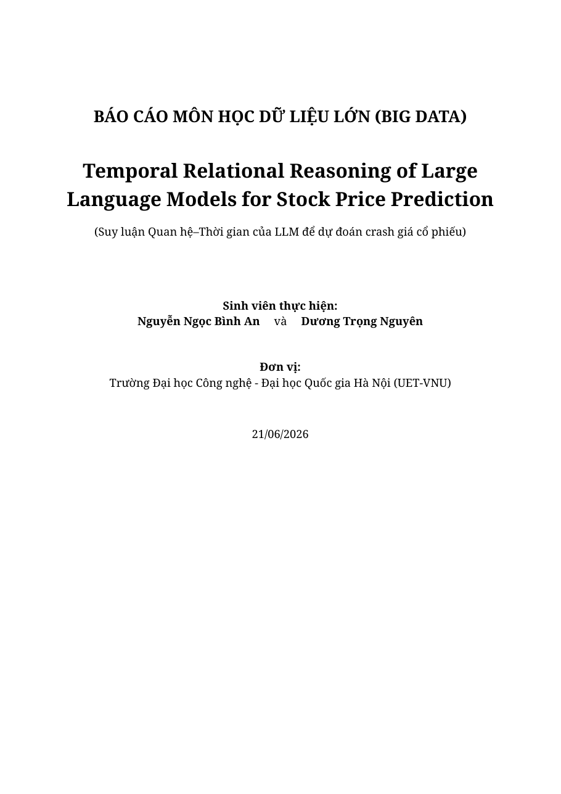
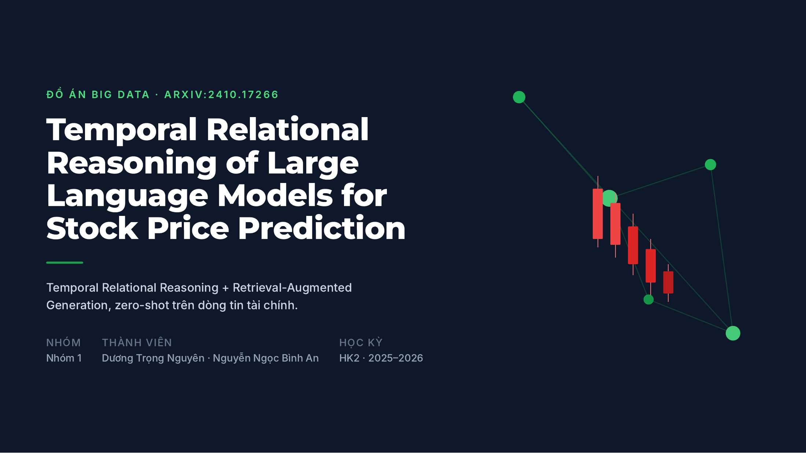

# Temporal Relational Reasoning of Large Language Models for Stock Price Prediction

**Big Data course project** — adapted from [arXiv:2410.17266](https://arxiv.org/abs/2410.17266).

A **zero-shot LLM** reads financial **news** and predicts the probability that an
equal-weight portfolio of large-cap stocks **crashes** (≥ 6% drop) over the next
~3 trading days. The model is **never trained** — it *reasons*, in four phases:

> **Brainstorm** (news → impact graph) → **Memory** (time-decay) → **Attention** (PageRank prune) → **Reason** (LLM → crash probability)

The narrowing from "price prediction" (the paper's title) to **crash / tail-risk
prediction** is deliberate: direction and raw price are ≈ chance under weak-form
market efficiency, while crash risk carries a real signal from news.

## 📦 Deliverables
| | |
|---|---|
| 📄 **Report (PDF)** | [`docs/BAO_CAO_VI.pdf`](docs/BAO_CAO_VI.pdf) · source: [`.tex`](docs/BAO_CAO_VI.tex) / [`.md`](docs/BAO_CAO_VI.md) |
| 📑 **Slides (PDF)** | [`docs/SLIDE_FINAL.pdf`](docs/SLIDE_FINAL.pdf) |
| 🎥 **Demo video** | [▶ Watch on Google Drive](https://drive.google.com/file/d/1wn5p-PKhR9AFaDvI3taqRd1AVDMMN4LU/view) (preview below) |
| 🌐 **Live web demo** | ⚠️ **Offline** — taken down after the course concluded. See the 🎥 demo video above; run locally with `streamlit run webapp/app.py`. |
| 📊 **Full results** | [`reports/RESULTS_TRR.md`](reports/RESULTS_TRR.md) |

**Preview — click a cover to open the full PDF (in GitHub's PDF viewer):**

<a href="docs/BAO_CAO_VI.pdf"></a> &nbsp;&nbsp; <a href="docs/SLIDE_FINAL.pdf"></a>

<sub>↑ Report cover (left) and Slides (right) — click to open the full PDF.</sub>

### 🎥 Demo video
**▶ [Watch the demo video (Google Drive)](https://drive.google.com/file/d/1wn5p-PKhR9AFaDvI3taqRd1AVDMMN4LU/view)**

---

## Why this is a Big Data project

| V | What we do | Numbers |
|---|---|---|
| **Volume** | stream-filter a 23 GB / 15.7M-article source → 2016–2023 corpus | **12 GB / 4.5M articles** |
| **Velocity** | live news daemon + Spark Structured Streaming | ~500 news/day, 60 s poll |
| **Variety** | company / macro / crypto / world news + OHLCV prices, multi-source | FNSPID + RSS + yfinance |
| **Value** | deployed crash-advisory web app + FastAPI | Streamlit + REST |

**Storage — "store enormous, serve tiny":** 12 GB corpus → date-indexed **SQLite**
(1.9 GB, ~44 ms/day lookup) → RAG-selected slice (~2 MB) served to the LLM.

**Distributed processing:**
- **Apache Spark** batch ETL: 12 GB corpus → **Parquet partitioned by year** (data-lake layout); 12 GB→718 MB in 101 s; queries read 4.5M rows in 2.4 s (~40×, partition-pruned). Same code runs on a cluster via `SPARK_MASTER=spark://…`.
- **Distributed fan-out**: the 32B backtest splits into **40 shards** (20 base + 20 RAG) run in parallel on a free Kaggle GPU pool — one ~20-min wave vs ~5 h single-run (same result; same code runs on a paid cloud/HPC cluster).

---

## 📚 Datasets

| Dataset | Role | Source |
|---|---|---|
| **FNSPID** (financial news, 1999–2023) | Big-data news corpus (23 GB / 15.7M → 12 GB / 4.5M articles) for the full-corpus backtest | [HuggingFace · Zihan1004/FNSPID](https://huggingface.co/datasets/Zihan1004/FNSPID) |
| **Analyst-ratings / partner headlines** | Compact headline corpus for the COVID / broad results (→ 9,872 portfolio rows) | [Kaggle · massive-stock-news-analysis-db](https://www.kaggle.com/datasets/miguelaenlle/massive-stock-news-analysis-db-for-nlpbacktests) |
| **Stock OHLCV** (daily) | Crash labels + price baselines for the 6 large-caps | [yfinance](https://github.com/ranaroussi/yfinance) (Yahoo Finance) |
| **Crypto OHLCV** (5-min, 6 assets) | Crypto cross-asset experiments (~441k windows) | [Binance API](https://github.com/binance/binance-public-data) |
| **Live news / prices** | Real-time monitor (deployment proof) | yfinance `.news` + [Google News RSS](https://news.google.com/) |

Derived data (12 GB corpus, 1.9 GB SQLite index, Parquet lake, RAG slices) is **gitignored** — only the code that regenerates it is tracked (`scripts/fetch_fnspid.py`, `scripts/build_stock_data.py`, `trr/corpus.py`).

---

## Method (TRR, `trr/`)

1. **Brainstorm** (`brainstorm.py`) — LLM turns each day's news into a directed **impact graph** (signed, weighted edges: news → entities → portfolio assets).
2. **Memory** (`memory.py`) — decaying store `R = exp(−t·λ)` carries the **temporal** signal across days (bad news fades over time).
3. **Attention** (`attention.py`) — PageRank-style prune to the top-*k* portfolio-relevant **relational** sub-graph.
4. **Reason** (`reason.py`) — LLM predicts crash probability from the pruned tuples.

**RAG** (`rag.py`, `corpus.py`, `select.py`) — two roles, both bound LLM cost to `O(days·k)`:
- *Retrieval-selection*: pick the *k* most portfolio-relevant headlines per day from the corpus.
- *Case-based few-shot* (causal lookback bank): retrieve similar **past labeled days** + their realized outcomes into the reasoning prompt.

**Models:** Qwen2.5-**32B** on Kaggle RTX 6000 Pro (offline batch) · Qwen2.5-**7B-AWQ** local on RTX 2060 SUPER (live). The pipeline code is identical for both and for the deterministic `MockLLM` used in tests.

**Portfolio:** AAPL, AMZN, GOOGL, NVDA, TSLA, NFLX. **Labels** (`prices`/`targets`): a day is a *crash* if the equal-weight portfolio's forward 3-day low breaches −6%.

---

## Headline results (crash AUROC)

Two separate historical news sources: the compact **Kaggle analyst-ratings** bundle (9,872 rows, 6 tickers) produced the headline numbers; the **FNSPID** corpus (12 GB / 4.5M) is the big-data scale-up.

| Setup | News source | AUROC |
|---|---|---|
| Stock COVID crash window | analyst-ratings | **0.785** (+RAG **0.847**) |
| Stock broad 2016–2020 | analyst-ratings | **0.710** |
| RAG lift (large-N) | analyst-ratings | **+0.074 (p = 0.009)** |
| news-volume baseline | analyst-ratings | ≈ 0.50 (signal is reasoning, not headline counts) |
| Full corpus 2016–2023 | FNSPID (portfolio-filtered) | base **0.615** / RAG **0.652** (news-vol 0.662) |

**Honest notes:** small-N is the real ceiling (14–82 crash days, ~4% base rate);
direction/raw price ≈ chance (weak-form EMH); naively scaling to an *all-ticker*
corpus with crash-query selection **hurt** (relevance ≠ portfolio-relevance) and
was fixed by portfolio filtering. Full study + negatives in [`reports/RESULTS_TRR.md`](reports/RESULTS_TRR.md).

---

## Repo map

```
trr/         TRR pipeline (brainstorm, memory, attention, reason, rag, corpus, select, prices, targets)
kaggle/      self-contained 32B kernels + distributed deploy/poll/eval scripts (gen_corpus_shards, launch_corpus, eval_corpus)
processing/  Apache Spark — corpus ETL (spark_corpus_etl) + Structured Streaming consumers
train/       meta-learner, ablations, backtest, figures, significance
serving/     FastAPI (/predict, /predict-ensemble, /backtest)
webapp/      Streamlit live crash-advisory dashboard
scripts/     live_daemon, build_corpus_news, fetch_fnspid, daily cron
docs/        BAO_CAO_VI.md (report), SLIDE_VI.md (slides), ARCHITECTURE, REPORT, SLIDES
reports/     RESULTS_TRR.md (master results)
```

---

## How to run

```bash
# venv: /home/nduong/dev/bigdata/.venv/bin/python  (bare `python` not on PATH)
.venv/bin/python -m pytest tests/ serving/tests/ -q        # tests (79 passing)
bash scripts/run_all.sh                                    # reproduce analysis (no GPU)
.venv/bin/streamlit run webapp/app.py                      # web app -> http://localhost:8501

# Big-data pipeline
.venv/bin/python -m trr.corpus build                       # 12 GB corpus -> date-indexed SQLite
.venv/bin/python -m processing.spark_corpus_etl            # corpus -> partitioned Parquet lake
.venv/bin/python -m scripts.build_corpus_news              # RAG-select portfolio news per day
python kaggle/gen_corpus_shards.py 20                      # generate 40 distributed shards
```

Derived data (12 GB corpus, 1.9 GB index, Parquet lake, RAG slices) is **gitignored** — only the code that regenerates it is tracked.
