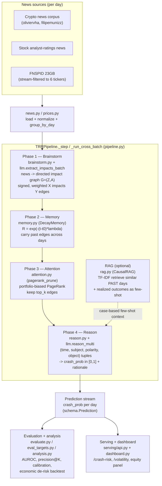

# System Architecture — Temporal Relational Reasoning (TRR)

This document describes the architecture of the TRR system: a zero-shot LLM
pipeline that reasons over financial **news** to predict portfolio **crashes**
(large draw-downs), plus the streaming "speed layer" and the local serving tier
that surround it. It is the engineering companion to [REPORT.md](REPORT.md);
every result quoted there comes from [`../reports/RESULTS_TRR.md`](../reports/RESULTS_TRR.md).

The system is built as a **lambda architecture**:

- a **batch layer** — the heavy zero-shot LLM (Qwen2.5-32B) run offline on a
  Kaggle RTX 6000 Pro GPU (no internet), which produces the authoritative
  crash-probability series and the campaign results; and
- a **speed layer** — a Kafka + Spark Structured Streaming stack that ingests
  live news and prices and produces a low-latency crash signal with a small
  model, served continuously by a FastAPI + Streamlit tier.

---

## 1. The TRR four-phase pipeline

The core method runs four phases **per day**, in chronological order, over a
stream of news. Memory persists across days, which is what makes the reasoning
*temporal*; the PageRank prune is what makes it *relational*.

### Phase detail

1. **Brainstorm** (`trr/brainstorm.py`, `trr/llm.py::extract_impacts[_batch]`).
   For each news item the LLM extracts directed `X --(polarity, weight)--> Y`
   impact edges (`ImpactEdge`), chaining articles through intermediary entities
   toward the portfolio assets. Polarity is +1 (bullish) / −1 (bearish); weight
   is in `[0, 1]`. The per-day **batched** path (`extract_impacts_batch`) issues
   one LLM call per day over a capped set of headlines — the only feasible path
   on the GPU quota for the ~31k-article corpus.
2. **Memory** (`trr/memory.py::DecayMemory`). Every edge is stored with the day
   index it was seen. On retrieval its relevance decays as
   `R = exp(-(current_step - entry_step) * lambda)`; entries below
   `min_relevance` are dropped. This carries a crash signal forward across days
   and lets it **fade** as the originating news ages.
3. **Attention** (`trr/attention.py::pagerank_prune`). A power-iteration
   PageRank runs over the edge node-graph with the teleport vector biased toward
   the portfolio tickers, so nodes relationally close to the portfolio score
   highest. Each edge is scored by `(rank[subject] + rank[object]) * |weight|`
   and the top_k edges are kept.
4. **Reason** (`trr/reason.py`, `trr/llm.py::reason_multi`). The pruned edges
   become `(time, subject, polarity, object)` tuples; the LLM is prompted (with
   a calibration block + three worked few-shot exemplars: no-crash /
   contained-stress / contagion) to output `{"crash_prob": 0..1, "rationale"}`.

**RAG extension** (`trr/rag.py::CausalRAG`). For each day, a TF-IDF + cosine
retriever finds the most similar **past** days (only days older than an embargo
≥ the 3-day label horizon, so it is leak-free) and injects their realized
crash/no-crash outcomes as dynamic, case-based few-shot examples into the Phase-4
context. It helps where historical analogues exist (stock/COVID +0.06) and is
marginal on heterogeneous one-off shocks (crypto +0.01).

---

## 2. The lambda architecture (batch + speed layers)

The heavy 32B model cannot serve live (no internet on Kaggle; 32B ≈ 65 GB VRAM
does not fit a small card), so the system splits along a classic lambda
boundary: a high-quality **batch layer** and a low-latency **speed layer** that
share the *same* pipeline code and prompts.

```mermaid
flowchart LR
    subgraph BATCH["BATCH LAYER — Kaggle offline lab (RTX 6000 Pro, NO internet)"]
        direction TB
        BD["Static news corpora<br/>crypto / stock / FNSPID<br/>+ yfinance prices"]
        BK["kaggle/trr_standalone.py<br/>TRRPipeline cross_batch<br/>Qwen2.5-32B zero-shot"]
        BR["Authoritative crash series<br/>trr_predictions.csv + eval_results.json<br/>campaign AUROC table"]
        BD --> BK --> BR
    end

    subgraph SPEED["SPEED LAYER — Kafka + Spark Structured Streaming (local, live)"]
        direction TB
        I1["ingestion/producer_news.py<br/>CryptoPanic API"]
        I2["ingestion/producer_price.py<br/>Binance aggTrade WS"]
        T1(["Kafka topic<br/>crypto-news"])
        T2(["Kafka topic<br/>crypto-price"])
        C1["processing/consumer_trr.py<br/>Spark + small LLM<br/>news -> live crash_prob"]
        C2["processing/consumer_price.py<br/>5-min feature windows"]
        T3(["Kafka topic<br/>crash-signal"])
        PQ["./data/.../*.parquet<br/>crash-signal store"]

        I1 --> T1 --> C1 --> T3 --> PQ
        I2 --> T2 --> C2
    end

    subgraph SERVE["SERVING TIER — local, always-on (FastAPI + Streamlit)"]
        direction TB
        API["serving/api.py<br/>/crash-risk /volatility /signal/latest<br/>pluggable backend (model_backend.py)"]
        DASH["serving/dashboard.py<br/>live risk + equity panel"]
        PT["serving/paper_trader.py<br/>de-risk backtest / live paper position"]
        API --> DASH
        API --> PT
    end

    BR -- adapter / merged weights cross the air-gap --> API
    PQ --> API
    BR -. validated thresholds + calibration .-> SPEED
```

- **Batch layer** is the source of truth: it scores whole multi-year windows
  offline and produces the campaign results. The only artifact that crosses the
  air-gap is a trained adapter / merged weights directory.
- **Speed layer** reproduces the same four-phase pipeline live with a small
  model (proven with Qwen2.5-1.5B end-to-end; Qwen-7B-AWQ ≈ 5.5 GB fits an 8 GB
  card), emitting a continuously-updated `crash-signal` Parquet store.
- **Serving tier** exposes the live crash probability and the LSTM volatility
  forecast over HTTP, with backends that **always degrade to the deterministic
  `MockLLM`** so the service never fails to come up.

---

## 3. Component → code map

| Component | Role | Code file |
|---|---|---|
| Data structures | `NewsItem`, `ImpactEdge`, `ImpactGraph`, `Prediction`, portfolio universe | `trr/schema.py` |
| News loader | Load / normalize / `group_by_day` news; asset tagging | `trr/news.py` |
| Price + labels (equities) | Daily close loader, equal-weight portfolio, crash & direction labels | `trr/prices.py` |
| Price + labels (crypto) | Crash labels from 5-min OHLCV (FTX/LUNA surface as worst drawdowns) | `trr/labels.py` |
| Phase 1 — Brainstorm | News → directed impact graph; multi-hop expansion | `trr/brainstorm.py` |
| Phase 2 — Memory | Time-decay edge store `R = exp(-t·λ)` | `trr/memory.py` |
| Phase 3 — Attention | Portfolio-biased PageRank prune to top_k | `trr/attention.py` |
| Phase 4 — Reason | Tuples → `crash_prob` + rationale | `trr/reason.py` |
| LLM backends | `ReasoningLLM` ABC, `MockLLM`, `HFReasoningLLM`; all prompts; batched forward | `trr/llm.py` |
| Pipeline orchestration | Per-day `_step` and batched `_run_cross_batch`; crash / direction / per-asset modes | `trr/pipeline.py` |
| RAG extension | Causal TF-IDF case-based few-shot retriever | `trr/rag.py` |
| Direction target | Next-day up/down `up_prob` target | `trr/targets.py`, `trr/eval_targets.py` |
| Evaluation | AUROC / PR-AUC / F1 vs baselines + plots | `trr/evaluate.py` |
| Rigorous analysis | Bootstrap CIs, leak-free ensemble, calibration, precision@K, economic backtest | `trr/analysis.py` |
| Advanced (cautionary) | Stacked meta-learner; GAT on the asset graph | `trr/stacking.py`, `trr/gnn.py` |
| Batch layer (GPU) | Kaggle RTX 6000 Pro zero-shot 32B kernels | `kaggle/trr_standalone.py`, `kaggle/stock_standalone.py` |
| Stock data build | Build the 6-stock news + price dataset | `scripts/build_stock_data.py` |
| Live-serving proof | Real small-model pipeline run end-to-end | `scripts/prove_live_serving.py` |
| Speed layer — ingest | CryptoPanic news + Binance price producers | `ingestion/producer_news.py`, `ingestion/producer_price.py` |
| Speed layer — process | Spark TRR scorer → `crash-signal`; 5-min price features | `processing/consumer_trr.py`, `processing/consumer_price.py` |
| Serving API | FastAPI `/crash-risk`, `/volatility`, `/signal/latest` | `serving/api.py` |
| Serving backends | Pluggable `heuristic` / `finetuned` / `api` backends | `serving/model_backend.py` |
| Dashboard | Live crash risk + equity panel | `serving/dashboard.py` |
| Paper trader | De-risk backtest + live paper position | `serving/paper_trader.py` |
